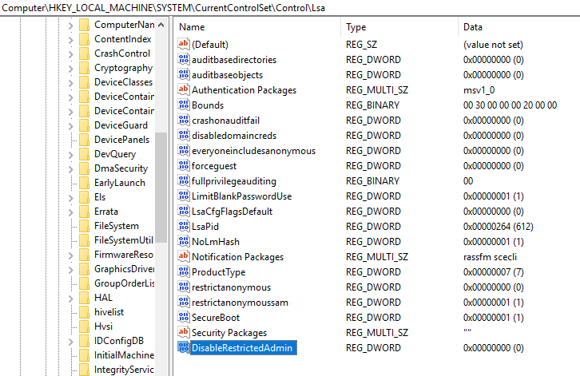
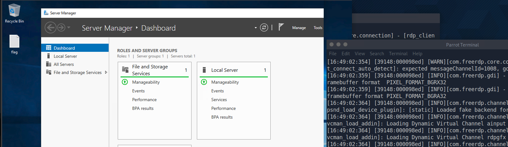

---
tags:
  - htb
  - linux
  - rdp
draft: false
date: 2026-06-18
title: attacking-rdp
---
### Q1: What is the name of the file that was left on the Desktop? (Format example: filename.txt)

Using given credentials we can RDP to the host machine and get the `.txt` file:
```
xfreerdp /v:$ipAddress$ /u:htb-rdp /p:'HTBRocks!'
```

### Q2: Which registry key needs to be changed to allow Pass-the-Hash with the RDP protocol?

we can find answer to this question directly in the notes.

### Q3: Connect via RDP with the Administrator account and submit the flag.txt as you answer.

After reading contents of `.txt` file from 1st question we obtained `Administrator's` account hash.

Our next move will be adding registry key to allow `Pass-the-Hash`:

after that we can try to connect to `Administrator's` account:
```
xfreerdp /v:$ipAddress$ /u:Administrator /pth:$AdminHash$
```

Last thing that was left to do is opening `flag.txt` file:

